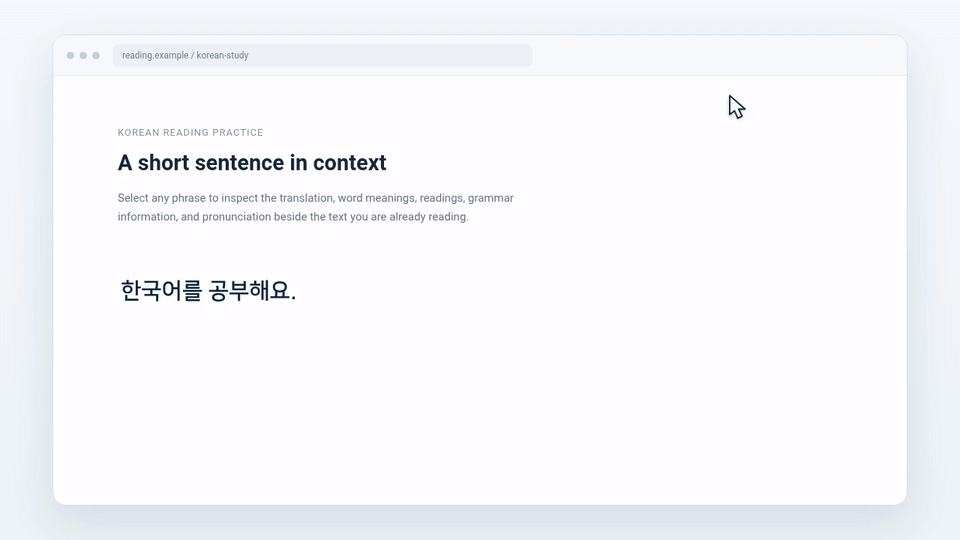

# Manhua Lens

**A free, open-source Chromium browser extension for reading manhwa, manhua, manga, and foreign-language webpages with instant word-by-word translation, readings, definitions, grammar hints, and pronunciation.**

Manhua Lens is built for language learners and readers who want to understand **Korean, Japanese, Chinese, French, or Spanish text directly on the page** without constantly switching to a separate dictionary or translator.

Highlight a phrase and Manhua Lens opens a compact reading panel with sentence translation, dictionary results for individual words, romanized readings, part-of-speech information, Korean particle handling, and text-to-speech.

  

## Why Manhua Lens?

Reading comics and native webpages is one of the fastest ways to meet real vocabulary in context, but looking up every unfamiliar word can interrupt the flow. Manhua Lens keeps the lookup beside the text you are already reading.

It can be useful for:

- **Manhwa readers** learning Korean
- **Manga readers** learning Japanese
- **Manhua readers** learning Chinese
- Language learners reading articles, forums, blogs, and other webpages
- Anyone who wants a lightweight **word-by-word browser dictionary and translator**

## Features

- Select text on a webpage to open an instant translation panel
- Word-by-word dictionary lookup for **Korean, Japanese, Chinese, French, and Spanish**
- Sentence translation alongside individual word results
- Romanized readings and part-of-speech information where available
- Korean particle splitting and grammar labels
- Sentence and individual-word pronunciation using the browser text-to-speech API
- Works on regular webpages and embedded frames
- Bundled offline dictionaries for resilient word lookup
- Graceful offline results when the online sentence-translation service is unavailable
- Toolbar popup with language settings and a built-in page activation check
- Manifest V3 extension for Microsoft Edge and Chromium-based browsers

## Supported languages

| Language | Word lookup | Reading / language hints | Pronunciation |
| --- | --- | --- | --- |
| Korean | Yes | Romanization, particles, grammar labels | Yes |
| Japanese | Yes | Reading information where available | Yes |
| Chinese | Yes | Reading information where available | Yes |
| French | Yes | Part-of-speech information where available | Yes |
| Spanish | Yes | Part-of-speech information where available | Yes |

## Install in Microsoft Edge

1. Download or clone this repository.
2. Open `edge://extensions`.
3. Enable **Developer mode**.
4. Click **Load unpacked**.
5. Select this repository folder — the folder containing `manifest.json`.
6. Allow Manhua Lens to run on all sites and refresh any tabs that were already open.

If a page does not respond to text selection, open Manhua Lens from Edge's Extensions menu. The settings popup checks whether the extension is active and can activate it on the current page.

> Edge does not allow content extensions to run on protected pages such as `edge://` URLs or the Edge Add-ons store.

## How to use

1. Choose the source and target languages from the toolbar popup.
2. Highlight text on an `http://` or `https://` webpage.
3. Read the sentence translation and word-by-word dictionary results in the popup panel.
4. Use the speaker controls for the whole selection or an individual word.
5. Clear the selection or press the panel's close button when finished.

## How it works

Manhua Lens uses a Manifest V3 service worker together with an in-page content script. The content script detects selected text and displays the reading panel, while the background worker handles dictionary lookup, translation requests, language processing, and text-to-speech.

Bundled dictionaries allow individual-word results to remain available even when an online sentence-translation service cannot be reached.

## Project structure

- `manifest.json` — Manifest V3 extension configuration
- `content.js` / `content.css` — selection detection and translation panel
- `background.js` — dictionary lookup, translation, language processing, and text-to-speech
- `options.html` / `options.js` — language settings and page activation check
- `dictionaries/` — bundled offline dictionary data and source notes
- `icons/` — extension icons

Dictionary provenance and transformation notes are documented in [`dictionaries/SOURCES.md`](dictionaries/SOURCES.md).

## Search-friendly description

Manhua Lens is an **open-source manhwa, manga, and manhua reading assistant**, **Korean/Japanese/Chinese dictionary extension**, and **word-by-word translation browser extension** for language learning and native-content reading.

## Current version

`0.2.4`

## Contributing

Bug reports, language-data improvements, UI refinements, and feature suggestions are welcome through GitHub Issues.

If you find Manhua Lens useful, starring the repository helps other readers and language learners discover the project through GitHub.
